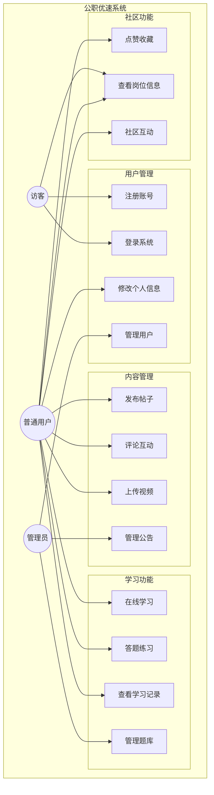

```mermaid
graph TB
    subgraph 公职优速系统
        %% 角色定义
        User((普通用户))
        Admin((管理员))
        Guest((访客))
        
        %% 用例定义
        subgraph 用户管理
            UC1[注册账号]
            UC2[登录系统]
            UC3[修改个人信息]
            UC4[管理用户]
        end
        
        subgraph 内容管理
            UC5[发布帖子]
            UC6[评论互动]
            UC7[上传视频]
            UC8[管理公告]
        end
        
        subgraph 学习功能
            UC9[在线学习]
            UC10[答题练习]
            UC11[查看学习记录]
            UC12[管理题库]
        end
        
        subgraph 社区功能
            UC13[点赞收藏]
            UC14[社区互动]
            UC15[查看岗位信息]
        end
        
        %% 关系定义
        Guest --> UC1
        Guest --> UC2
        Guest --> UC15
        
        User --> UC3
        User --> UC5
        User --> UC6
        User --> UC7
        User --> UC9
        User --> UC10
        User --> UC11
        User --> UC13
        User --> UC14
        User --> UC15
        
        Admin --> UC4
        Admin --> UC8
        Admin --> UC12
    end
```